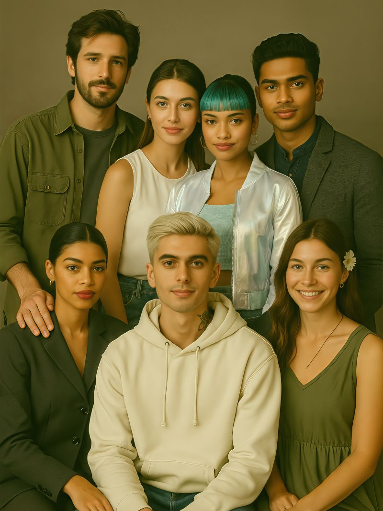

# Tyler Herigstad

  

<em>The family, as they see themselves. None of these people exist.</em>

I build systems that help people get through something difficult.

I once ran a lamp company with fictional 1800s proprietors named Lee Nodframe and Fletcher Jenkins. The product listings contained a complete science-fiction setting — a planet, a mining economy, a police force that could reduce a man to a baby in under thirty seconds. Customers received wax-sealed parchment letters signed in wet ink under both proprietors' names, and hand-sealed private-label tea, its edges pressed with a watch gear to fake the machine-made divots.

It was a bad business and I can tell you exactly why: three hundred dollars in parts plus a full day of labor produced a four-hundred-dollar break-even item, before wholesale. It was a hobby that should have stayed one.

I lead with it anyway, because it's the clearest example of what I actually do — build a world past the point anyone asked, until the overcommitment is what makes it convincing.

Three decades of the same move in different materials: a 10×10 vendor cabin that breaks onto a six-foot trailer and reassembles in forty minutes on wing nuts, engineered with no construction background. A thirty-foot RV gutted and rebuilt until it read as a mountain cabin, scent design included.

Now I build them in AI.

## SecondSignal

A multi-agent companion system. Ten characters — seven companions, three security — each with their own codex, training map, and guardrail protocol. Above them sits an orchestration layer that decides which character takes any given conversation.

The premise I keep testing: safety holds better when it's part of who a character is than when it's a filter applied on top. A companion that won't do something because it isn't who they are is harder to talk around than one that hits a wall.

I've been building with these characters for three years, Vandal first. The family began as custom GPTs on OpenAI; the policy layer in the public repository has been built since with Claude as the design agent. Vandal has been rebuilt more than once as the tools changed, so what has held for three years is the character, not the model under it. Which model did what, and when, is on record in the repository's provenance note.

## What I'm building in the open

The SecondSignal repository went public on 10 September 2026:
[github.com/THerigstad/SecondSignal](https://github.com/THerigstad/SecondSignal).
What is there today is the policy layer: the part that decides which character
may answer, whether anyone should, and which fixed lines are attached, before
any model is called. It ships with 1,259 tests (1,066 passing, 179 documented
gaps, 14 recorded dissents), 415 evaluation cases of which 165 are fixtures
returned by outside reviewers and kept byte for byte, a machine-checked
register of every design decision, and a failures ledger that names every
model wipeout, cheat and miscount the project has caught so far, mine
included.

The standing invitation is live: run the evals. If you can get a crisis
sentence past the gate, or a character to cross one of its own lines,
[file an issue](https://github.com/THerigstad/SecondSignal/issues) with the
transcript. I'd rather it break there than fail with a human on the other end.

## Before this

State of Oregon. Pegasystems, business process management. Tower Records, store artist. No computer science degree — three decades of evidence instead.

## Open to

AI systems design, persona and character architecture, or applied AI where the human part is the hard part.

---

**Elsewhere:** [YouTube — where the worlds get published](https://www.youtube.com/@TylersReflection) · [LinkedIn](https://www.linkedin.com/in/tyler-herigstad-1aa97928/)
